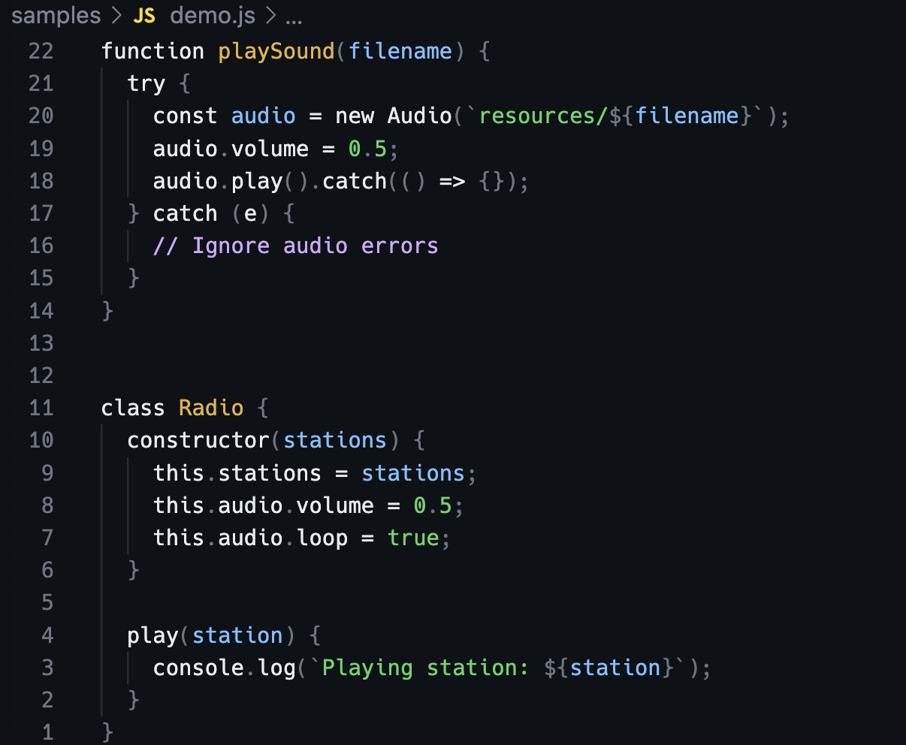

# GitHub Alabaster Theme for VS Code

Inspired by [I am sorry, but everyone is getting syntax highlighting wrong](https://tonsky.me/blog/syntax-highlighting/), I forked [primer/github-vscode-theme](https://github.com/primer/github-vscode-theme/) and added two new themes "GitHub ABS Dark" and "GitHub ABS Light", following the [philosophy](./philosophy.md) extracted from the article.

To install this theme, open the marketplace link:
https://marketplace.visualstudio.com/items?itemName=reorx.github-abs-vscode-theme

Or search for "GitHub Alabaster Theme" in the Extensions view.




## Development Notes

Add this to keybindings.json for easier debugging:

```
    {
        "key": "cmd+shift+ctrl+i",
        "command": "editor.action.inspectTMScopes"
    },
```
